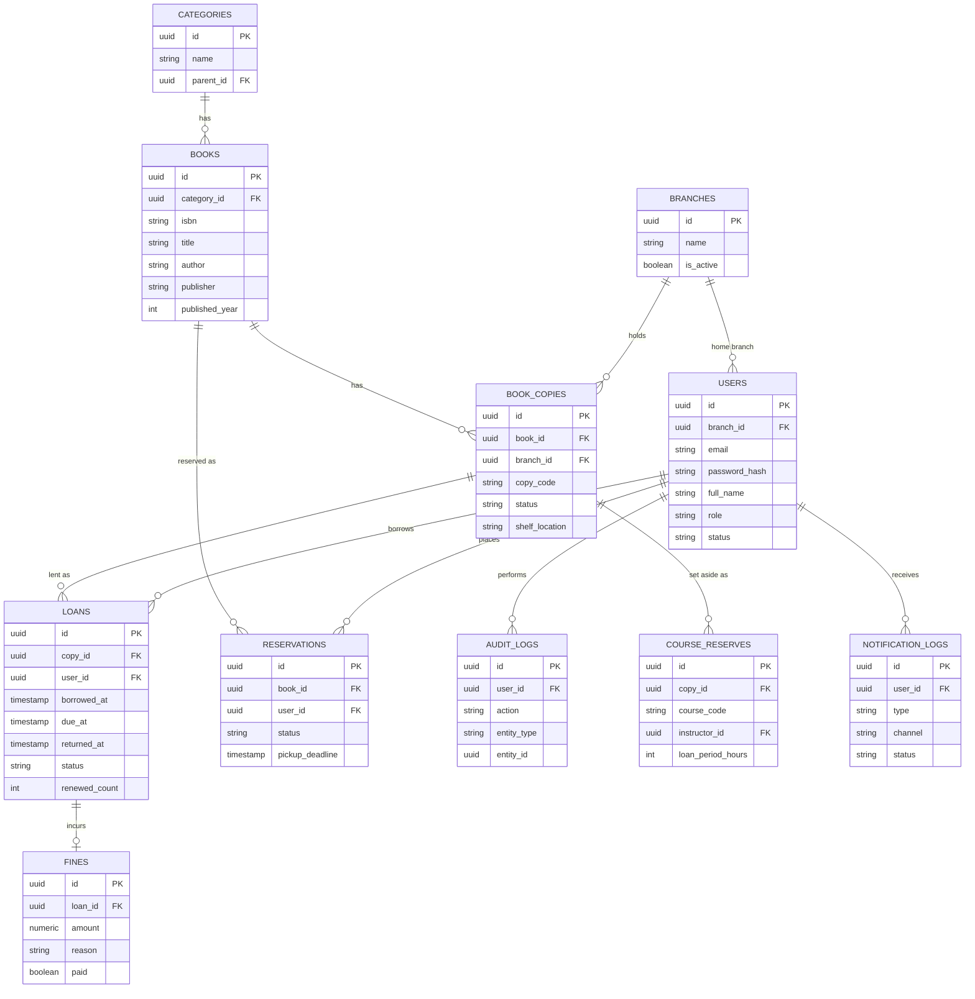

# ข้อกำหนดระบบยืมคืนหนังสือสำหรับสถานศึกษา (Requirements Specification)

> เอกสารนี้รวบรวมจากการวิจัยแนวทางออกแบบระบบห้องสมุด (ILS/LMS) ของสถาบันการศึกษาจริงหลายแห่ง มาตรฐาน ILS ทั่วไป และกฎหมาย PDPA ของไทย เพื่อใช้เป็น requirement อ้างอิงในการพัฒนา

---

## 1. ภาพรวมโครงการ

**วัตถุประสงค์**: พัฒนาเว็บแอปพลิเคชันจัดการการยืม-คืนหนังสือสำหรับห้องสมุดสถานศึกษา (โรงเรียน/มหาวิทยาลัย) เน้นใช้งานง่าย ฐานข้อมูลออกแบบดี และความปลอดภัยของข้อมูล

**ขอบเขต**: ครอบคลุมตั้งแต่การจัดการทรัพยากร (หนังสือ) การยืม-คืน การจอง ค่าปรับ การแจ้งเตือน ไปจนถึงรายงานสำหรับผู้บริหารห้องสมุด

---

## 2. ผู้ใช้งานระบบ (Actors)

| บทบาท | คำอธิบาย |
|---|---|
| **Admin** | ตั้งค่าระบบ จัดการสิทธิ์ผู้ใช้ทั้งหมด ดูรายงานภาพรวม |
| **บรรณารักษ์ (Librarian)** | จัดการหนังสือ ดำเนินการยืม-คืน จัดการค่าปรับ อนุมัติการจอง |
| **อาจารย์/บุคลากร (Faculty/Staff)** | ยืมได้ในเงื่อนไขพิเศษ (จำนวน/ระยะเวลามากกว่า) ตั้งหนังสือสำรองสำหรับวิชาเรียนได้ |
| **นักศึกษา/นักเรียน (Student)** | ค้นหา ยืม จอง ต่ออายุ ดูประวัติและค่าปรับของตนเอง |

---

## 3. Functional Requirements

### 3.1 การจัดการผู้ใช้ (User Management)
- ลงทะเบียน/เข้าสู่ระบบ พร้อมกำหนดบทบาท (role-based)
- แนะนำให้เชื่อมกับฐานข้อมูลทะเบียนนักศึกษา/บุคลากรของสถาบัน (SIS) เพื่อลดการกรอกข้อมูลซ้ำและอัปเดตสถานะสมาชิกภาพอัตโนมัติ (เช่น จบการศึกษาแล้วตัดสิทธิ์ยืม)
- ระงับสิทธิ์การยืมชั่วคราวเมื่อมีค่าปรับค้างชำระเกินเพดาน หรือมีหนังสือค้างคืนเกินกำหนดจำนวนหนึ่ง

### 3.2 การจัดการทรัพยากร/แคตตาล็อก (Catalog Management)
- CRUD ข้อมูลหนังสือ: ชื่อเรื่อง ผู้แต่ง สำนักพิมพ์ ISBN หมวดหมู่ ปีพิมพ์
- **แยกระเบียน title (บรรณานุกรม) ออกจาก item/copy (สำเนาจริงแต่ละเล่ม)** ตามแนวทาง ILS มาตรฐาน เพราะหนังสือชื่อเดียวกันมักมีหลายเล่ม แต่ละเล่มมีสถานะของตัวเอง (ว่าง/ถูกยืม/สูญหาย/ชำรุด)
- ค้นหา/กรองตามชื่อเรื่อง ผู้แต่ง หมวดหมู่ สถานะความพร้อมให้ยืม
- รองรับปกหนังสือ/รูปภาพประกอบ เพื่อ UX ที่ดีขึ้น

### 3.3 การยืม-คืน (Circulation)
- Check-out (ยืม) / Check-in (คืน) ผ่านบาร์โค้ดหรือค้นหาด้วยมือ
- **กำหนด loan period แยกตามบทบาท** — รูปแบบที่พบทั่วไปในห้องสมุดมหาวิทยาลัย: นักศึกษายืมได้สั้นกว่า (เช่น 14-28 วัน) อาจารย์/บุคลากรยืมได้ยาวกว่ามาก (บางที่ให้ยืมได้ทั้งภาคการศึกษา) และมี**จำนวนเล่มสูงสุดที่ยืมพร้อมกันได้**แยกตามบทบาทเช่นกัน
- **ต่ออายุ (Renew)**: จำกัดจำนวนครั้ง (พบบ่อยคือ 2-6 ครั้ง) ระยะเวลาต่ออายุเท่ากับ loan period เดิม และ**ต่อไม่ได้ถ้ามีคนอื่นจองเล่มนั้นอยู่**
- **เรียกคืนก่อนกำหนด (Recall)**: เมื่อมีคนจองหนังสือที่ถูกยืมอยู่ ระบบย่นวันครบกำหนดของผู้ยืมเดิมได้ ตามนโยบายที่ตั้งไว้ (มีประโยชน์มากสำหรับหนังสือสำรองวิชาเรียน)
- **Grace period**: ช่วงเวลาก่อนเริ่มคิดค่าปรับหลังเกินกำหนด (พบทั่วไป 1-7 วัน)

### 3.4 การจอง (Reservation / Hold Queue)
- จองหนังสือที่ถูกยืมอยู่ เข้าคิวแบบ FIFO
- สถานะของการจองที่ควรมี: `Waiting` (รอคิว) → `Ready` (พร้อมให้ยืม) → `Fulfilled` (รับไปแล้ว) หรือ `Expired`/`Cancelled`
- เมื่อหนังสือถูกคืน ระบบตรวจคิวจองอัตโนมัติ กำหนด pickup deadline ให้คนแรกในคิว และแจ้งเตือน ถ้าไม่มารับภายในเวลาที่กำหนด (พบทั่วไป 3-7 วัน) จะส่งต่อให้คนถัดไปอัตโนมัติ
- ผู้ใช้ควร**พักการจอง (freeze/pause)** ได้ชั่วคราวโดยไม่เสียลำดับคิว (เผื่อกรณีไม่สะดวกมารับช่วงนั้น)

### 3.5 ค่าปรับ (Fines)
- คำนวณอัตโนมัติตามจำนวนวันเกินกำหนด (อัตราอาจต่างกันตามประเภททรัพยากร)
- บันทึกสถานะชำระ/ยังไม่ชำระ พร้อมประวัติการชำระ
- ระงับสิทธิ์ยืม/จอง/ต่ออายุ เมื่อยอดค่าปรับเกินเพดานที่กำหนด
- เผื่อไว้สำหรับกรณีหนังสือสูญหาย/ชำรุด: ค่าปรับ = ราคาทดแทน + ค่าดำเนินการ

### 3.6 การแจ้งเตือน (Notifications)
- แจ้งเตือนก่อนครบกำหนดคืน (เช่น ล่วงหน้า 2-3 วัน)
- แจ้งเตือนเมื่อเกินกำหนด (overdue)
- แจ้งเตือนเมื่อหนังสือที่จองพร้อมให้ยืม พร้อมวันหมดเขตมารับ
- ช่องทางที่ควรรองรับ: อีเมล เป็นพื้นฐาน และพิจารณา LINE Notify/LINE OA เพิ่มเติม เนื่องจากเป็นช่องทางที่นักศึกษาไทยเข้าถึงและอ่านเร็วกว่าอีเมลในหลายกรณี

### 3.7 หนังสือสำรองสำหรับวิชาเรียน (Course Reserve) — เฉพาะสถานศึกษา
- อาจารย์ตั้งหนังสือบางเล่มเป็น "reserve" สำหรับนักศึกษาทั้งชั้นเรียน ให้ยืมได้ระยะสั้นเป็นพิเศษ (เช่น ยืมภายในห้องสมุดเท่านั้น หรือยืมได้ไม่กี่ชั่วโมง/วัน) เพื่อให้ทุกคนมีโอกาสเข้าถึงเท่าเทียมกัน

### 3.8 รายงานและแดชบอร์ด (Reports & Analytics)
- หนังสือที่ถูกยืมบ่อยที่สุด, สถิติการยืม-คืนรายเดือน/รายภาคการศึกษา
- รายการหนังสือค้างคืน, รายรับค่าปรับ
- รายงานตรวจนับสต็อก (เทียบสถานะจริงในระบบกับที่ควรมีบนชั้น)

### 3.9 Audit Trail
- บันทึกทุก transaction สำคัญ (ยืม/คืน/แก้ไขข้อมูล/เข้าถึงข้อมูลส่วนบุคคล) พร้อมผู้กระทำและเวลา — จำเป็นทั้งด้าน accountability และการปฏิบัติตาม PDPA

---

## 4. Non-Functional Requirements

| หมวด | ข้อกำหนด |
|---|---|
| **Performance** | ตอบสนองคำขอทั่วไปภายใน ~2 วินาที |
| **Availability** | พร้อมใช้งานตลอดเวลาทำการห้องสมุด กู้คืนได้ภายใน 1 ชั่วโมงหากระบบล่ม |
| **Scalability** | ห้องสมุดสถานศึกษาทั่วไปมี concurrent user ระดับหลักร้อยถึงหลักพัน (ไม่ใช่หลักหมื่น) ออกแบบให้รองรับระดับนี้ก็เพียงพอสำหรับ MVP |
| **Usability** | ใช้งานได้โดยไม่ต้องฝึกอบรมมาก รองรับภาษาไทยเต็มรูปแบบ |
| **Maintainability** | เพิ่ม/แก้ไขฟีเจอร์ได้ง่าย — สอดคล้องกับ hexagonal architecture ที่แยก domain ออกจาก infrastructure |
| **Accessibility** | ควรคำนึงถึง WCAG โดยเฉพาะหากเป็นระบบของสถานศึกษาของรัฐ |
| **Data accuracy** | ข้อมูลหนังสือและค่าปรับต้องถูกต้อง สอดคล้อง (consistent) เสมอ |

---

## 5. Security & Privacy Requirements

- **Authentication/Authorization**: JWT + refresh token, RBAC ตามบทบาทผู้ใช้ (ตามที่ออกแบบไว้ก่อนหน้า)
- **Data minimization**: เก็บเฉพาะข้อมูลส่วนบุคคลที่จำเป็นต่อการให้บริการ ลดความเสี่ยงหากข้อมูลรั่วไหล
- **ความยินยอมและวัตถุประสงค์**: ตาม พ.ร.บ.คุ้มครองข้อมูลส่วนบุคคล พ.ศ. 2562 (PDPA) ต้องแจ้งวัตถุประสงค์การเก็บ ใช้ หรือเปิดเผยข้อมูลส่วนบุคคล และขอความยินยอมจากเจ้าของข้อมูลก่อนเก็บ
- **ข้อมูลอ่อนไหว (Sensitive Personal Data)**: หากในอนาคตพิจารณาใช้ biometric (เช่น สแกนลายนิ้วมือแทนบัตรนักศึกษา) ต้องขอความยินยอมแยกต่างหากอย่างเข้มงวดกว่าข้อมูลทั่วไป เพราะเข้าข่ายข้อมูลอ่อนไหวตามกฎหมาย
- **การเข้ารหัสและการสำรองข้อมูล**: เข้ารหัสข้อมูลสำรอง (backup) เพื่อป้องกันการเข้าถึงโดยไม่ได้รับอนุญาต
- **บุคคลที่สาม/API ภายนอก**: หากเชื่อมต่อบริการภายนอก (เช่น อีเมล, LINE Notify) ต้องตรวจสอบว่าการส่งข้อมูลเข้ารหัสและไม่สร้างโปรไฟล์พฤติกรรมผู้ใช้เกินความจำเป็น
- **Audit log**: บันทึกการเข้าถึง/แก้ไขข้อมูลส่วนบุคคล เพื่อตรวจสอบย้อนหลังได้
- **การตรวจสอบความปลอดภัยสม่ำเสมอ**: ทดสอบเจาะระบบ (pen test) ก่อน deploy จริง โดยเฉพาะจุดที่เสี่ยงต่อ IDOR (เช่น ผู้ใช้คนหนึ่งเข้าถึง/แก้ไขข้อมูลการยืมของอีกคนได้หรือไม่)

---

## 6. ข้อกำหนดเฉพาะสถานศึกษา (Educational-Institution Specific)

- เชื่อมต่อ/sync กับระบบทะเบียนนักศึกษา (SIS) เพื่อให้ข้อมูลสมาชิกเป็นปัจจุบันอัตโนมัติ
- กำหนดสิทธิ์การยืม (จำนวนเล่ม/ระยะเวลา) แยกตามสถานะ: นักศึกษาปริญญาตรี, บัณฑิตศึกษา, อาจารย์, บุคลากร
- รองรับหนังสือสำรองสำหรับวิชาเรียน (course reserve) ตามข้อ 3.7
- หากสถาบันมีหลายวิทยาเขต/สาขา ควรออกแบบให้รองรับหลายสาขาตั้งแต่ระดับฐานข้อมูล (branch/location) แม้ MVP จะเปิดใช้สาขาเดียวก่อนก็ตาม
- พิจารณานโยบายยืมพิเศษช่วงปิดภาคเรียน (ยืมได้นานขึ้นกว่าปกติ)

---

## 7. Database Schema

### 7.1 คำอธิบายตาราง

| ตาราง | หน้าที่ |
|---|---|
| `branches` | วิทยาเขต/สาขาห้องสมุด — ผูกกับทั้งผู้ใช้ (home branch) และสำเนาหนังสือ (ที่ตั้งจริง) |
| `categories` | หมวดหมู่หนังสือ รองรับหมวดหมู่ย่อยผ่าน `parent_id` |
| `users` | ผู้ใช้ทุกบทบาท (admin/librarian/faculty/staff/student) |
| `borrowing_policies` | กำหนดสิทธิ์การยืม (จำนวนเล่มสูงสุด, ระยะเวลายืม, จำนวนครั้งต่ออายุ, grace period, อัตราค่าปรับ) แยกตาม role — ปรับค่าได้โดยไม่ต้องแก้โค้ด |
| `books` | ระเบียนบรรณานุกรม (title) — 1 title มีได้หลายสำเนา |
| `book_copies` | สำเนาจริงแต่ละเล่ม พร้อมสถานะและตำแหน่งชั้นวาง |
| `loans` | ธุรกรรมยืม-คืน ผูกกับสำเนาหนังสือเล่มที่ยืมจริง |
| `reservations` | คิวจอง พร้อมสถานะตาม lifecycle (waiting → ready → fulfilled/expired) |
| `fines` | ค่าปรับ ผูกกับ loan (กรณีเกินกำหนด) หรือสร้างแยกได้ (กรณีสูญหาย/ชำรุด) |
| `course_reserves` | หนังสือที่อาจารย์ตั้งสำรองสำหรับวิชาเรียน ยืมได้ระยะสั้นเป็นพิเศษ |
| `notification_logs` | ประวัติการแจ้งเตือนที่ส่งไปแล้ว กันส่งซ้ำและใช้ตรวจสอบ |
| `audit_logs` | บันทึกทุก action สำคัญ พร้อมผู้กระทำและเวลา (metadata เป็น JSONB เก็บรายละเอียดเพิ่มเติมได้ยืดหยุ่น) |

### 7.2 ER Diagram



*(หมายเหตุ: ตาราง `borrowing_policies` ไม่ปรากฏใน diagram เพราะผูกกับ `role` ด้วยค่า enum ไม่ใช่ foreign key — ดูรายละเอียดใน DDL ด้านล่าง)*

### 7.3 SQL DDL (PostgreSQL)

```sql
-- Extension สำหรับสร้าง UUID
CREATE EXTENSION IF NOT EXISTS pgcrypto;

-- Enum types
CREATE TYPE user_role AS ENUM ('admin', 'librarian', 'faculty', 'staff', 'student');
CREATE TYPE user_status AS ENUM ('active', 'suspended', 'graduated', 'inactive');
CREATE TYPE copy_status AS ENUM ('available', 'borrowed', 'reserved', 'lost', 'damaged', 'withdrawn');
CREATE TYPE loan_status AS ENUM ('active', 'returned', 'overdue', 'lost');
CREATE TYPE reservation_status AS ENUM ('waiting', 'ready', 'fulfilled', 'expired', 'cancelled', 'suspended');
CREATE TYPE fine_reason AS ENUM ('overdue', 'lost', 'damaged');
CREATE TYPE notification_type AS ENUM ('due_reminder', 'overdue', 'reservation_ready');
CREATE TYPE notification_channel AS ENUM ('email', 'line');
CREATE TYPE notification_status AS ENUM ('pending', 'sent', 'failed');

-- วิทยาเขต/สาขา
CREATE TABLE branches (
  id UUID PRIMARY KEY DEFAULT gen_random_uuid(),
  name VARCHAR(150) NOT NULL,
  address TEXT,
  is_active BOOLEAN NOT NULL DEFAULT true,
  created_at TIMESTAMPTZ NOT NULL DEFAULT now()
);

-- หมวดหมู่หนังสือ
CREATE TABLE categories (
  id UUID PRIMARY KEY DEFAULT gen_random_uuid(),
  name VARCHAR(100) NOT NULL,
  parent_id UUID REFERENCES categories(id) ON DELETE SET NULL,
  created_at TIMESTAMPTZ NOT NULL DEFAULT now()
);

-- ผู้ใช้งาน
CREATE TABLE users (
  id UUID PRIMARY KEY DEFAULT gen_random_uuid(),
  email VARCHAR(255) NOT NULL UNIQUE,
  password_hash TEXT NOT NULL,
  full_name VARCHAR(150) NOT NULL,
  role user_role NOT NULL DEFAULT 'student',
  student_or_staff_id VARCHAR(50) UNIQUE,
  phone VARCHAR(20),
  branch_id UUID REFERENCES branches(id) ON DELETE SET NULL,
  status user_status NOT NULL DEFAULT 'active',
  created_at TIMESTAMPTZ NOT NULL DEFAULT now(),
  updated_at TIMESTAMPTZ NOT NULL DEFAULT now()
);
CREATE INDEX idx_users_role ON users(role);

-- นโยบายการยืมแยกตาม role (ปรับค่าได้โดยไม่ต้องแก้โค้ด)
CREATE TABLE borrowing_policies (
  id UUID PRIMARY KEY DEFAULT gen_random_uuid(),
  role user_role NOT NULL UNIQUE,
  max_active_loans INT NOT NULL DEFAULT 5,
  loan_period_days INT NOT NULL DEFAULT 14,
  max_renewals INT NOT NULL DEFAULT 2,
  grace_period_days INT NOT NULL DEFAULT 3,
  daily_fine_rate NUMERIC(10,2) NOT NULL DEFAULT 5.00,
  max_unpaid_fine NUMERIC(10,2) NOT NULL DEFAULT 100.00,
  created_at TIMESTAMPTZ NOT NULL DEFAULT now()
);

-- ระเบียนบรรณานุกรม (title)
CREATE TABLE books (
  id UUID PRIMARY KEY DEFAULT gen_random_uuid(),
  isbn VARCHAR(20),
  title VARCHAR(300) NOT NULL,
  author VARCHAR(200) NOT NULL,
  publisher VARCHAR(200),
  category_id UUID REFERENCES categories(id) ON DELETE SET NULL,
  description TEXT,
  cover_url TEXT,
  published_year INT,
  created_at TIMESTAMPTZ NOT NULL DEFAULT now(),
  updated_at TIMESTAMPTZ NOT NULL DEFAULT now()
);
CREATE INDEX idx_books_title_search ON books USING GIN (to_tsvector('simple', title));
CREATE INDEX idx_books_category ON books(category_id);

-- สำเนาจริงแต่ละเล่ม
CREATE TABLE book_copies (
  id UUID PRIMARY KEY DEFAULT gen_random_uuid(),
  book_id UUID NOT NULL REFERENCES books(id) ON DELETE CASCADE,
  branch_id UUID REFERENCES branches(id) ON DELETE SET NULL,
  copy_code VARCHAR(50) NOT NULL UNIQUE,
  status copy_status NOT NULL DEFAULT 'available',
  shelf_location VARCHAR(50),
  acquired_at DATE,
  created_at TIMESTAMPTZ NOT NULL DEFAULT now()
);
CREATE INDEX idx_book_copies_status ON book_copies(status);
CREATE INDEX idx_book_copies_book ON book_copies(book_id);

-- การยืม-คืน
CREATE TABLE loans (
  id UUID PRIMARY KEY DEFAULT gen_random_uuid(),
  copy_id UUID NOT NULL REFERENCES book_copies(id) ON DELETE RESTRICT,
  user_id UUID NOT NULL REFERENCES users(id) ON DELETE RESTRICT,
  borrowed_at TIMESTAMPTZ NOT NULL DEFAULT now(),
  due_at TIMESTAMPTZ NOT NULL,
  returned_at TIMESTAMPTZ,
  status loan_status NOT NULL DEFAULT 'active',
  renewed_count INT NOT NULL DEFAULT 0 CHECK (renewed_count >= 0),
  checked_out_by UUID REFERENCES users(id) ON DELETE SET NULL,
  checked_in_by UUID REFERENCES users(id) ON DELETE SET NULL,
  created_at TIMESTAMPTZ NOT NULL DEFAULT now()
);
CREATE INDEX idx_loans_user ON loans(user_id);
CREATE INDEX idx_loans_copy ON loans(copy_id);
CREATE INDEX idx_loans_status_due ON loans(status, due_at);

-- การจอง
CREATE TABLE reservations (
  id UUID PRIMARY KEY DEFAULT gen_random_uuid(),
  book_id UUID NOT NULL REFERENCES books(id) ON DELETE CASCADE,
  user_id UUID NOT NULL REFERENCES users(id) ON DELETE CASCADE,
  branch_id UUID REFERENCES branches(id) ON DELETE SET NULL,
  status reservation_status NOT NULL DEFAULT 'waiting',
  reserved_at TIMESTAMPTZ NOT NULL DEFAULT now(),
  ready_at TIMESTAMPTZ,
  pickup_deadline TIMESTAMPTZ,
  fulfilled_loan_id UUID REFERENCES loans(id) ON DELETE SET NULL,
  created_at TIMESTAMPTZ NOT NULL DEFAULT now()
);
CREATE INDEX idx_reservations_book_status ON reservations(book_id, status);
CREATE INDEX idx_reservations_user ON reservations(user_id);

-- ค่าปรับ
CREATE TABLE fines (
  id UUID PRIMARY KEY DEFAULT gen_random_uuid(),
  loan_id UUID REFERENCES loans(id) ON DELETE CASCADE,
  user_id UUID NOT NULL REFERENCES users(id) ON DELETE RESTRICT,
  amount NUMERIC(10,2) NOT NULL CHECK (amount >= 0),
  reason fine_reason NOT NULL,
  paid BOOLEAN NOT NULL DEFAULT false,
  paid_at TIMESTAMPTZ,
  waived BOOLEAN NOT NULL DEFAULT false,
  created_at TIMESTAMPTZ NOT NULL DEFAULT now()
);
CREATE INDEX idx_fines_user_paid ON fines(user_id, paid);

-- หนังสือสำรองสำหรับวิชาเรียน
CREATE TABLE course_reserves (
  id UUID PRIMARY KEY DEFAULT gen_random_uuid(),
  copy_id UUID NOT NULL REFERENCES book_copies(id) ON DELETE CASCADE,
  course_code VARCHAR(30) NOT NULL,
  course_name VARCHAR(200),
  instructor_id UUID REFERENCES users(id) ON DELETE SET NULL,
  loan_period_hours INT NOT NULL DEFAULT 3,
  start_date DATE NOT NULL,
  end_date DATE NOT NULL,
  created_at TIMESTAMPTZ NOT NULL DEFAULT now(),
  CHECK (end_date >= start_date)
);
CREATE INDEX idx_course_reserves_copy ON course_reserves(copy_id);

-- ประวัติการแจ้งเตือน
CREATE TABLE notification_logs (
  id UUID PRIMARY KEY DEFAULT gen_random_uuid(),
  user_id UUID NOT NULL REFERENCES users(id) ON DELETE CASCADE,
  type notification_type NOT NULL,
  channel notification_channel NOT NULL,
  reference_id UUID,
  status notification_status NOT NULL DEFAULT 'pending',
  sent_at TIMESTAMPTZ,
  created_at TIMESTAMPTZ NOT NULL DEFAULT now()
);
CREATE INDEX idx_notification_logs_user ON notification_logs(user_id);

-- Audit log
CREATE TABLE audit_logs (
  id UUID PRIMARY KEY DEFAULT gen_random_uuid(),
  user_id UUID REFERENCES users(id) ON DELETE SET NULL,
  action VARCHAR(100) NOT NULL,
  entity_type VARCHAR(50) NOT NULL,
  entity_id UUID,
  metadata JSONB,
  created_at TIMESTAMPTZ NOT NULL DEFAULT now()
);
CREATE INDEX idx_audit_logs_entity ON audit_logs(entity_type, entity_id);
CREATE INDEX idx_audit_logs_created ON audit_logs(created_at);
```

### 7.4 หมายเหตุการออกแบบ

- ใช้ `UUID` เป็น primary key ทุกตาราง เพื่อไม่ให้ค่า id เดาง่าย (ป้องกัน enumeration attack ระดับหนึ่ง) และรองรับการ merge ข้อมูลข้ามระบบในอนาคต
- `loans.copy_id` และ `fines.user_id` ใช้ `ON DELETE RESTRICT` เพราะเป็นข้อมูลธุรกรรมที่ต้องเก็บประวัติไว้เสมอ ห้ามลบผู้ใช้/สำเนาที่ยังมีประวัติผูกอยู่
- `audit_logs.metadata` เป็น `JSONB` เพื่อเก็บรายละเอียดของแต่ละ action ได้ยืดหยุ่นโดยไม่ต้องแก้ schema ทุกครั้งที่เพิ่ม action ใหม่
- ทำ full-text search index (GIN) บน `books.title` รองรับการค้นหาแบบไม่ต้องพิมพ์ตรงเป๊ะ
- แยก `checked_out_by` / `checked_in_by` ใน `loans` ไว้ เผื่อกรณีบรรณารักษ์เป็นผู้ดำเนินการแทนผู้ใช้ (ต่างจาก `user_id` ซึ่งคือเจ้าของการยืม)

---

## 8. ขอบเขตที่ไม่รวมใน MVP (Out of Scope)

- การเชื่อมต่อฮาร์ดแวร์ RFID (ออกแบบ API/workflow ให้รองรับได้ในอนาคต แต่ MVP ใช้บาร์โค้ด/ค้นหาด้วยมือก็เพียงพอ)
- Interlibrary loan (ยืมข้ามสถาบัน)
- E-resource/digital lending (ebook)
- โมดูล acquisition/จัดซื้อจัดหาแบบเต็มรูปแบบ

---

## 9. แหล่งอ้างอิง (References)

- Studocu — Functional requirements of library management system
- GeeksforGeeks — Library Management System Project
- OpenGenus — System Design of Library Management System (non-functional requirements)
- Vidyalaya School Software — Key features of school library management software
- FitGap — Best library management systems for education
- Librarian's Toolbox / ScienceDirect / Soutron — Integrated Library System (ILS) core modules
- Lee College, Miami University, LIU Post, Penn Libraries, Pitt, Middlebury, Iowa — ตัวอย่างนโยบายยืม-คืนของมหาวิทยาลัยจริง (loan period, renewal, fines)
- Librarika docs, RCLS/Koha handbook — Hold queue lifecycle
- ALA — Library Privacy Guidelines / Checklist for Library Management Systems
- Ex Libris (Alma) — Security and Privacy documentation
- Tech Logic, D-Tech International, RFID Label — RFID/self-checkout ในห้องสมุด
- พ.ร.บ.คุ้มครองข้อมูลส่วนบุคคล พ.ศ. 2562 (PDPA) และเอกสารสรุปจาก Digital Council of Thailand
